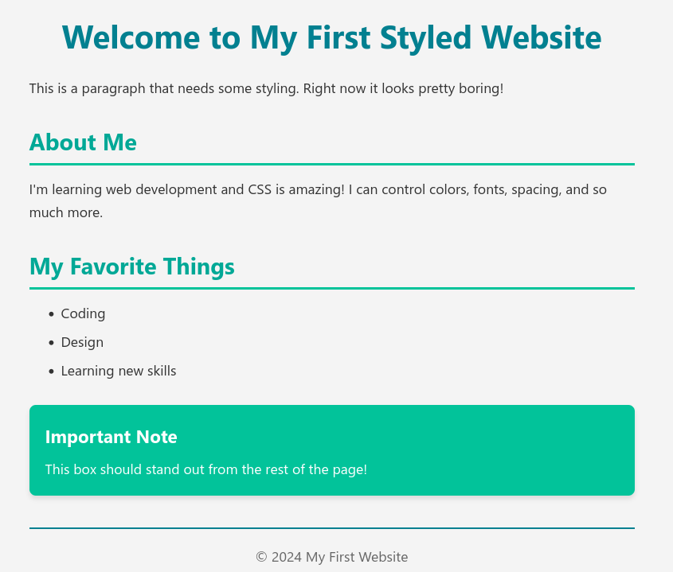

# CSS Workshop

Starter code for the CSS & Styling Websites workshop.

## Practice Guide

### Practice 1: General Styling

The goal of this project is to style `practice-1.html` to match the following design:



The colors used are as follows:
- Normal Text: `#333`
- Background: `#f4f4f4`
- Header 1: `#028090`
- Header 2: `#00A896`
- Header 3: `#028090`
- Highlight Box: `#02C39A`
- Footer Divider: `#028090`

And the font family is `'Segoe UI', Tahoma, Geneva, Verdana, sans-serif`. You can center the content by using `margin: 0 auto;` on the body element.

---

# CSS Quick Reference Guide

## CSS Syntax

```css
selector {
    property: value;
}
```

**Example:**
```css
h1 {
    color: blue;
    font-size: 32px;
}
```

---

## Common Selectors

| Selector | Example | Description |
|----------|---------|-------------|
| Element | `p { }` | All `<p>` elements |
| Class | `.button { }` | Elements with `class="button"` |
| ID | `#header { }` | Element with `id="header"` |
| Descendant | `div p { }` | All `<p>` inside `<div>` |
| Child | `div > p { }` | Direct `<p>` children of `<div>` |
| Multiple | `h1, h2, h3 { }` | All headings |
| Pseudo-class | `a:hover { }` | Link on hover |

---

## Common Properties

### Colors
```css
color: red;                     /* Text color */
color: #028090;               /* Hex code */
color: rgb(2, 128, 144);      /* RGB */
background-color: lightblue;    /* Background */
```

### Typography
```css
font-family: Arial, sans-serif;
font-size: 16px;              /* or 1rem, 1.2em */
font-weight: bold;            /* or 400, 700 */
text-align: center;           /* left, right, justify */
line-height: 1.6;
text-decoration: underline;
```

### Spacing
```css
/* Margin - space OUTSIDE element */
margin: 20px;                /* All sides */
margin: 10px 20px;           /* Top/bottom Left/right */
margin: 10px 20px 15px 25px; /* Top Right Bottom Left */
margin-top: 10px;

/* Padding - space INSIDE element */
padding: 20px;               /* Same syntax as margin */
```

### Size
```css
width: 300px;                /* or 50%, 20rem */
height: 200px;
max-width: 1200px;
min-height: 100px;
```

### Borders
```css
border: 2px solid black;
border-radius: 8px;          /* Rounded corners */
border-top: 1px dashed gray;
box-shadow: 0 2px 4px rgba(0,0,0,0.1);
```

### Display & Position
```css
display: block;              /* block, inline, none */
position: relative;          /* static, absolute, fixed */
top: 10px;                   /* Works with position */
z-index: 10;                 /* Stacking order */
```

---

## The Box Model

```
┌─────────────────────────────┐
│        MARGIN               │
│   ┌─────────────────────┐   │
│   │     BORDER          │   │
│   │  ┌───────────────┐  │   │
│   │  │   PADDING     │  │   │
│   │  │  ┌─────────┐  │  │   │
│   │  │  │ CONTENT │  │  │   │
│   │  │  └─────────┘  │  │   │
│   │  └───────────────┘  │   │
│   └─────────────────────┘   │
└─────────────────────────────┘
```

**Important:**
```css
* {
    box-sizing: border-box;  /* Makes life easier! */
}
```

---

## Flexbox Cheat Sheet

### Container Properties
```css
.container {
    display: flex;
    
    /* Direction */
    flex-direction: row;     /* row, column */
    
    /* Horizontal alignment (main axis) */
    justify-content: center; /* flex-start, flex-end, 
                                space-between, space-around */
    
    /* Vertical alignment (cross axis) */
    align-items: center;     /* flex-start, flex-end, 
                                stretch, baseline */
    
    /* Wrapping */
    flex-wrap: wrap;         /* nowrap, wrap */
    
    /* Spacing */
    gap: 20px;               /* Space between items */
}
```

### Item Properties
```css
.item {
    flex: 1;                 /* Grow to fill space */
    flex-grow: 1;            /* Growth factor */
    flex-shrink: 0;          /* Shrink factor */
    align-self: flex-end;    /* Override align-items */
}
```

**Common Patterns:**
```css
/* Center anything */
.center {
    display: flex;
    justify-content: center;
    align-items: center;
}

/* Equal-width columns */
.columns {
    display: flex;
    gap: 20px;
}
.columns > * {
    flex: 1;
}

/* Navigation bar */
.navbar {
    display: flex;
    justify-content: space-between;
    align-items: center;
}
```

---

## CSS Grid Cheat Sheet

### Container Properties
```css
.grid-container {
    display: grid;
    
    /* Define columns */
    grid-template-columns: 1fr 1fr 1fr;     /* 3 equal columns */
    grid-template-columns: 200px 1fr;       /* Fixed + flexible */
    grid-template-columns: repeat(3, 1fr);  /* Same as first */
    
    /* Define rows */
    grid-template-rows: 100px auto 100px;
    
    /* Gaps */
    gap: 20px;               /* Both row and column */
    row-gap: 20px;
    column-gap: 10px;
}
```

### Item Properties
```css
.item {
    grid-column: 1 / 3;      /* Span columns 1-2 */
    grid-row: 1 / 2;         /* Span row 1 */
    grid-column: span 2;     /* Span 2 columns */
}
```

**Common Patterns:**
```css
/* Auto-fit responsive grid */
.responsive-grid {
    display: grid;
    grid-template-columns: repeat(auto-fit, minmax(250px, 1fr));
    gap: 20px;
}

/* 12-column grid system */
.grid-12 {
    display: grid;
    grid-template-columns: repeat(12, 1fr);
    gap: 20px;
}
```

---

## Responsive Design

### Media Queries
```css
/* Mobile first approach */

/* Default styles (mobile) */
.container {
    flex-direction: column;
}

/* Tablet and up */
@media (min-width: 768px) {
    .container {
        flex-direction: row;
    }
}

/* Desktop */
@media (min-width: 1024px) {
    .container {
        max-width: 1200px;
        margin: 0 auto;
    }
}
```

### Common Breakpoints
- **Mobile:** < 768px
- **Tablet:** 768px - 1024px
- **Desktop:** > 1024px
- **Large Desktop:** > 1440px

---

## Tips & Best Practices

### Do's ✓
- Use external stylesheets for production
- Keep specificity low (use classes)
- Use meaningful class names
- Group related styles together
- Test on different screen sizes
- Use consistent spacing
- Limit your color palette

### Don'ts ✗
- Avoid `!important` (use only when necessary)
- Don't use inline styles everywhere
- Don't use IDs for styling (use classes)
- Don't forget to test in different browsers
- Don't use too many fonts
- Don't ignore accessibility

### Performance
- Minimize CSS file size
- Combine multiple stylesheets
- Use CSS minification in production
- Avoid complex selectors
- Use efficient selectors (class > descendant)

### Debugging
- Use browser DevTools (F12 / Ctrl+Shift+I / Cmd+Opt+I)
- Inspect elements to see applied styles
- Check for typos in properties
- Verify selector specificity
- Look for overridden styles
- Validate CSS: https://jigsaw.w3.org/css-validator/

---

## Resources

### Learning
- **MDN Web Docs:** https://developer.mozilla.org/en-US/docs/Web/CSS
- **CSS-Tricks:** https://css-tricks.com/
- **Flexbox Froggy:** https://flexboxfroggy.com/
- **Grid Garden:** https://cssgridgarden.com/

### Reference
- **Can I Use:** https://caniuse.com/ (browser compatibility)
- **Tailwind Docs:** https://tailwindcss.com/docs
- **CSS Cheat Sheet:** https://htmlcheatsheet.com/css/

### Tools
- **Color Picker:** https://htmlcolorcodes.com/
- **Gradient Generator:** https://cssgradient.io/
- **Box Shadow Generator:** https://cssgenerator.org/box-shadow-css-generator.html
- **Flexbox Generator:** https://flexbox.buildwithreact.com/

### Practice
- **Frontend Mentor:** https://www.frontendmentor.io/
- **CSS Battle:** https://cssbattle.dev/
- **Scrimba:** https://scrimba.com/
- **freeCodeCamp:** https://www.freecodecamp.org/

---

## Common CSS Values

### Units
- `px` - Pixels (fixed)
- `%` - Percentage (relative to parent)
- `em` - Relative to parent font size
- `rem` - Relative to root font size (recommended)
- `vw/vh` - Viewport width/height
- `fr` - Fraction (Grid)

### Colors
- **Named:** `red`, `blue`, `lightgray`
- **Hex:** `#FF0000`, `#028090`
- **RGB:** `rgb(255, 0, 0)`
- **RGBA:** `rgba(255, 0, 0, 0.5)` (with transparency)
- **HSL:** `hsl(200, 100%, 50%)`

### Fonts
**Web-safe fonts:**
- Arial, Helvetica, sans-serif
- Georgia, serif
- "Courier New", monospace
- Verdana, sans-serif
- "Times New Roman", serif

**Font stacks (always provide fallbacks):**
```css
font-family: 'Your Font', Arial, sans-serif;
```
